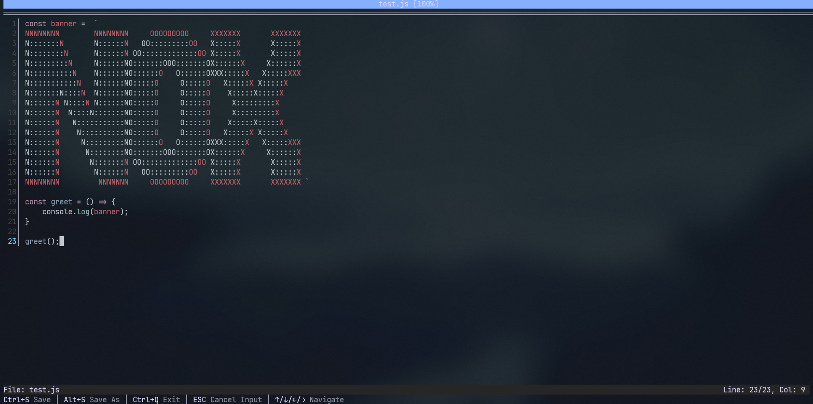

# Nox Editor



A terminal-based text editor written in Rust, featuring syntax highlighting, toast notifications, and a modern user interface.

## Features

- **Terminal-based Interface**: Full-screen text editing experience in your terminal
- **Syntax Highlighting**: Powered by the `syntect` library for beautiful code highlighting
- **Toast Notifications**: Real-time feedback with color-coded notifications (Info, Success, Warning, Error)
- **File Operations**:
  - Open existing files or start with a new untitled document
  - Save files with `Ctrl+S`
  - Save As functionality with `Alt+S`
- **Input Handling**:
  - Interactive input prompts for file operations
  - Support for standard text editing operations (insert, delete, newline, tab)
- **Responsive UI**: Adapts to terminal size with proper layout management

## Installation

### Quick Installation (Recommended)

Use our automated installation script for the easiest setup:

```bash
curl -sSL https://raw.githubusercontent.com/Tony-ArtZ/nox-editor/main/install.sh | bash
```

Or if you prefer to download and inspect the script first:

```bash
curl -sSL https://raw.githubusercontent.com/Tony-ArtZ/nox-editor/main/install.sh -o install.sh
chmod +x install.sh
./install.sh
```

**Troubleshooting Installation:**

If you encounter issues, try these options:

```bash
# For debug output
DEBUG=1 curl -sSL https://raw.githubusercontent.com/Tony-ArtZ/nox-editor/main/install.sh | bash

# For interactive mode (choose installation directory)
curl -sSL https://raw.githubusercontent.com/Tony-ArtZ/nox-editor/main/install.sh -o install.sh
chmod +x install.sh
./install.sh --interactive
```

The installation script will:

- ✅ Check and install Rust automatically if needed
- ✅ Clone the repository and build the project
- ✅ Install the binary to your chosen location
- ✅ Provide setup instructions for your PATH

### Manual Installation

#### Prerequisites

- Rust (latest stable version)
- Unix-like operating system (Linux, macOS)
- Git

#### Building from Source

1. Clone the repository:

```bash
git clone https://github.com/Tony-ArtZ/nox-editor.git
cd nox-editor
```

2. Build the project:

```bash
cargo build --release
```

3. Install the binary (optional):

```bash
# Install to ~/.local/bin (make sure it's in your PATH)
cp target/release/nox-editor ~/.local/bin/

# Or install system-wide (requires sudo)
sudo cp target/release/nox-editor /usr/local/bin/
```

4. Run the editor:

```bash
nox-editor [filename]
```

## Usage

### Starting the Editor

```bash
# Open a new untitled file
nox-editor

# Open an existing file
nox-editor /path/to/your/file.txt
```

### Keyboard Shortcuts

| Key Combination      | Action                                  |
| -------------------- | --------------------------------------- |
| `Arrow Keys`         | Navigate cursor (Up, Down, Left, Right) |
| `Ctrl+S`             | Save current file                       |
| `Alt+S`              | Save As (prompts for new filename)      |
| `Ctrl+Q`             | Quit editor                             |
| `Enter`              | New line                                |
| `Tab`                | Insert tab character                    |
| `Backspace`/`Delete` | Delete character                        |
| `Ctrl+O`             | Open File Browser                       |

### Interface Components

- **Title Bar**: Displays the editor name and current file
- **Content Area**: Main editing area with syntax highlighting
- **Status Bar**: Shows cursor position and file information
- **Toast Notifications**: Temporary messages for user feedback
- **Input Prompts**: Interactive dialogs for file operations
- **File Browser**: Browse and open files

## Dependencies

- `termios`: Terminal I/O control
- `libc`: System interface
- `syntect`: Syntax highlighting engine
- `lazy_static`: Global static initialization

## Architecture

The editor is organized into several modules:

- `main.rs`: Entry point and main event loop
- `lib.rs`: Core data structures (Buffer, FileManager, Toast system)
- `renderer/`: UI rendering and display logic
- `fm/`: File management operations
- `utils/`: Terminal utilities and color management

### Key Components

- **FileManager**: Central component managing the editing session
- **Buffer**: Text data storage and manipulation
- **InputHandler**: Manages user input modes and prompts
- **Toast System**: Notification management with automatic expiration
- **Renderer**: Terminal UI rendering with syntax highlighting

## Development

### Project Structure

```
src/
├── main.rs           # Main application entry point
├── lib.rs           # Core library with data structures
├── fm/              # File management
│   └── mod.rs
├── renderer/        # UI rendering
│   └── mod.rs
└── utils/           # Utilities
    ├── mod.rs       # Terminal utilities
    └── colors.rs    # Color definitions
```

### Building for Development

```bash
# Run in development mode
cargo run

# Run with a specific file
cargo run -- example.txt

# Build optimized release
cargo build --release
```

## Contributing

1. Fork the repository
2. Create a feature branch
3. Make your changes
4. Add tests if applicable
5. Submit a pull request

## License

This project is open source. Please refer to the LICENSE file for details.

## Roadmap

- [ ] Undo/Redo functionality
- [ ] Multiple file tabs
- [ ] Find and replace functionality
- [ ] Configuration file support
- [ ] LSP system
- [ ] Plugin system
- [ ] Word wrap support

## Credits

Built with Rust and the following excellent libraries:

- [syntect](https://github.com/trishume/syntect) for syntax highlighting
- [termios](https://github.com/dcuddeback/termios-rs) for terminal control
